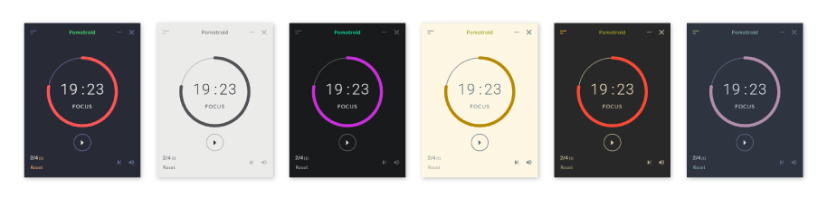
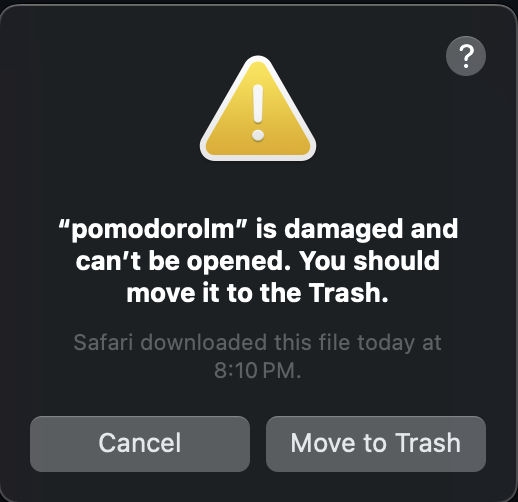

<!-- logo -->
<p align="center">
  
</p>

<!-- tag line -->
<h2 align='center'>Pomodorolm<br />simple yet powerful time tracker</h3>
<br/>
<br/>

---


# 🌟 Features

- [x] **Customize round numbers, focus and break times**
- [x] **Customize current and default session labels**
- [x] **Auto-start round** (optional)
- [x] **Desktop notifications** (optional)
- [x] **Built-in [themes](#-themes)**
- [x] **Custom [themes](#-themes)**
- [x] **Color gradient** depending on the remaining time
- [x] **Tray icon** with color gradient
- [x] **Minimize to tray** (optional)
- [x] **Tick and end sounds** (optional)
- [x] **Multi-platform**: Linux, Mac, Windows
- [x] **Resizable window** with automatic scaling
- [x] **Always on top** (optional)
- [x] Fully compatible with **HiDPI/4K screens**
- [x] Linux: **Wayland** and **X11** support
- [x] Small: size < 4Mb (no electron, no node)
- [x] Custom sounds
- [ ] Mini mode
- [ ] Terminal User Interface
- [ ] Mobile version

# 📘 Installation

## Windows

Installer: Download the .exe or .msi file from the latest release on https://github.com/vjousse/pomodorolm/releases/

winget: `winget install pomodorolm`

## Archlinux

    yay -S pomodorolm-bin

## Mac OS X, Debian, AppImage

Download the install file for your OS from the latest release on https://github.com/vjousse/pomodorolm/releases/

## Flatpak

<a href="https://flathub.org/apps/org.jousse.vincent.Pomodorolm">
    
</a>

    flatpak install flathub org.jousse.vincent.Pomodorolm
    flatpak run org.jousse.vincent.Pomodorolm

## Snap Store

[](https://snapcraft.io/pomodorolm)

# 🎨 Themes

Pomodorolm provides many themes. It's also theme-able, allowing you to customize its appearance.



Visit the [theme documentation](./docs/themes/themes.md) to view the full list of official themes and for instruction on creating your own.

# Command Line Interface

> [!WARNING]
> This is still a huge Work In Progress and only supports Pomodoro creation/reset/stop. Nothing else is handled for now (no breaks, no sound, no config change, …).

By default, Pomodorolm will start the GUI version, but there is a CLI interface available if you want (mainly a proof of concept for now). To get the available commands you can run the help:

    pomodorolm --help

You can run the current cli program with:

    pomodorolm cli

You should see the following output looping forever:

```
P -
P -
P -
```

The cli is based on https://github.com/dattanchu/pymodoro. It will look for the presence of the file `~/.cache/pomodoro_session`.

To start or reset a Pomodoro:

    touch ~/.cache/pomodoro_session

To stop the Pomodoro:

    rm ~/.cache/pomodoro_session

You can add a Waybar/i3bar module if you want to:

```
  "custom/pomodorolm": {
    "exec": "pomodorolm cli",
  },
```

And add keybindings in your Sway/i3 config to touch and/or remove the session file.

# 💻 Dev

You will need to [install rust](https://www.rust-lang.org/tools/install) first and [https://github.com/astral-sh/uv](uv) for the`pre-commit` hooks and the release script.

## Install `pre-commit` hooks

    uv sync
    uv run pre-commit install

## Install node dependencies

    npm ci

## Running the app

    npm run tauri dev

## Running only the webapp

    npm run dev

## Running the CLI

    npm run tauri dev -- -- -- cli

# 🔨 Build

If you're using Linux be sure to set the `NO_STRIP` env var to `true` (see https://github.com/tauri-apps/tauri/issues/8929 ) if the build is failing.

    NO_STRIP=true npm run tauri build -- --target x86_64-unknown-linux-gnu

If the build is still failing try to understand why using:

    NO_STRIP=true npm run tauri build -- --target x86_64-unknown-linux-gnu --verbose

You can also try to build using `docker-compose` (to maximize compatibility, normal build is failing on Archlinux for example):

    docker-compose run --rm --build build-linux

Build files will be placed in the `target/` directory.

# 💀 Troubleshooting

## macOS

### `pomodorolm` is damaged and can’t be opened

<p>
  
</p>

Check the following issue: https://github.com/vjousse/pomodorolm/issues/149

TLDR, in a terminal: `sudo xattr -cr /Applications/pomodorolm.app`.

## Linux

### `Failed to create GBM buffer of size…`

If you run into this error, it is likely because you're using nvidia drivers under Linux. They are several bug reports in Webkit, cf this issue for wails: https://github.com/wailsapp/wails/issues/2977#issuecomment-1791041741.

You can try to run `pomodorolm` using this command:

    WEBKIT_DISABLE_DMABUF_RENDERER=1 pomodorolm

Thanks to [@Bad3r](https://github.com/Bad3r) for the [bug report](https://github.com/vjousse/pomodorolm/issues/62)!

### `Error 71 (Protocol error) dispatching to Wayland display.`

If you are using the flatpak, you can resolve this issue by using this command:

    flatpak override --user --env=WEBKIT_DISABLE_DMABUF_RENDERER=1 org.jousse.vincent.Pomodorolm

This will set the environment variable for the flatpak, and you should be able to launch the application as normal from there on.

## Windows

### App starts and then closes immediately or doesn't start at all

Check that your antivirus (Windows defender or whatever antivirus you are using) doesn't report the app as a trojan. Unfortunately, there is a known issue https://github.com/tauri-apps/tauri/issues/2486 on Tauri where a false positive is reported when executing apps generated with Tauri on Windows.

# 💯 Credits

Thanks to https://github.com/Splode/pomotroid for the original design and ideas.
