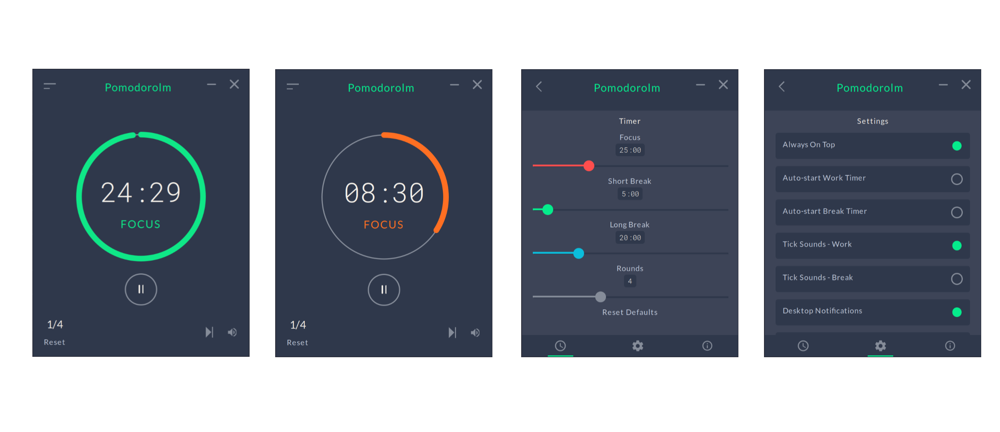

# Installation

You will need to [install rust](https://www.rust-lang.org/tools/install) first.

    npm i

# Running the app

    npm run tauri dev

# Running only the webapp

    npm run dev

# Screenshot

# Credits

Design taken from https://github.com/Splode/pomotroid
